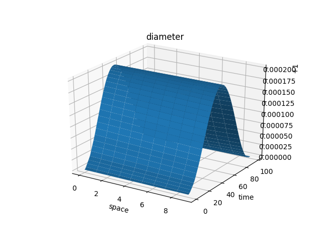

# preCICE Fluid-Structure Coupling Example for a 1D Elastic Tube

For more information see [1]. Scenario taken from [2].

If you want, a tutorial takes you step by step through this case.  
https://github.com/precice/precice/wiki/1D-Example

## Compile Instructions

First, clone this repository to your computer.

### Dependencies

Additionally you have to take care of the following:

* **preCICE** See https://github.com/precice/precice for details. Building instructions for preCICE can be found under https://github.com/precice/precice/wiki/Building. Make sure that the environment variable *PRECICE_ROOT* points to the preCICE root directory.

* **LAPACK**. You have to install LAPACK. For linux you can simply use ```$ sudo apt-get install liblapack-dev``` to install lapack from the official repositories.

### Compilation

Execute *scons* on the command line in the root directory of this tutorial. Follow the instructions on the screen to set boolean variables as required. The following boolean variables are of particular interest:
1) *parallel*: set to "on" to compile the parallel version of the tutorial
2) *supermuc*: set to "on" if executing on SuperMUC (www.lrz.de)

In case you link preCICE statically and you use Python or PETSC in preCICE, you can control linking of these libraries here similarly to preCICE with the option *python* (default off) and *petsc* (default on).

Example: ```$ scons petsc=off python=on```

## Execution
Start the two solvers, preferably in two seperate shells for output monitoring

   **For serial mode**:

	   ./StructureSolver ./ConfigurationFiles/precice-config.xml N

	   ./FluidSolver ./ConfigurationFiles/precice-config.xml N tau kappa

   **For parallel mode**:

	   mpiexec -np <nprocs> ./StructureSolver ./ConfigurationFiles/precice-config-parallel.xml N

	   mpiexec -np <nprocs> ./FluidSolver ./ConfigurationFiles/precice-config-parallel.xml N tau kappa

Use the same directory to start from to ensure that preCICE can set up the communication.

## Parameters

### N
Number of mesh elements, needs to be equal for fluid and structure solver

### tau
The dimensionless time step size.
Try tau = 0.01 or 0.1 as starting value.

### kappa
Dimensionless structural stiffness.
Try kappa = 10..100 as starting value.

### Example parameter set
A set of values that is known to converge: N=100, tau=0.01, kappa=100

## Postprocessing / Visualization

Postprocessing output is only created if the program is run in serial mode. Running the program like explained above creates ```.vtk``` output data in ```elastictube1d/Postproc```. The array pressure, velocity and diameter hold the respective quantities of the fluid. You can use the python script ```Postproc/fluid.py``` to visualize the data. **If you want to use this script you have to install the python packages vtk and numpy**. In the root directory of this project (```elastictube1d```) type

```
$ python Postproc/fluid.py <quantity> Postproc/<prefix>
```

To create a plot of the quantity ```<quantity>```(insert ```pressure```, ```velocity``` or ```diameter``` here) over time. ```<prefix>``` describes the prefix of the vtk files to be parsed for generating output. As a default value here you should use ```out_fluid_``` to parse the vtk files generated by the program.

**Example input**
```
$ python Postproc/fluid.py diameter Postproc/out_fluid_
```
Resulting output:  


## References

[1] M. Mehl, B. Uekermann, H. Bijl, D. Blom, B. Gatzhammer, and A. van Zuijlen.
Parallel coupling numerics for partitioned fluid-structure interaction simulations. CAMWA, 2016.  
[2] J. Degroote, P. Bruggeman, R. Haelterman, and J. Vierendeels. Stability of a coupling technique
for partitioned solvers in FSI applications. Computers & Structures, 2008.
